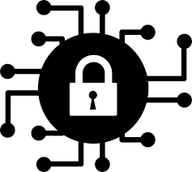

# :albania: ROOT Toolkit مجموعة أدوات متطورة
[](https://github.com/pedroalbanese/roottk/blob/master/LICENSE.md) 
[](http://godoc.org/github.com/pedroalbanese/roottk)
[](https://github.com/pedroalbanese/roottk/releases)
[](https://goreportcard.com/report/github.com/pedroalbanese/roottk)
[](https://golang.org)
[](https://github.com/pedroalbanese/roottk/releases)

<div align="center">
 </img>
</div>

### α Command-line ECC Integrated Security Suite
Multi purpose cross-platform hybrid cryptography tool for symmetric and asymmetric encryption, cipher-based message authentication code (CMAC), parallelizable message authentication code (PMAC), recursive hash digest, hash-based message authentication code (HMAC), HMAC-based key derivation function (HKDF), password-based key derivation function (PBKDF2/Scrypt), digital signature (ECDSA/EdDSA/ECGOST), shared key agreement (ECDH/X25519/VKO) and TLS 1.2 instant server for small or embedded systems. 
### I. Asymmetric الخوارزميات:
- I.I. **ECC Bit-length Equivalence**

    | Symmetric Key Size  | RSA and DSA Key Size  | ECC Key Size   | 
    |:-------------------:|:---------------------:|:--------------:| 
    | 80                  | 1024                  | 160            | 
    | 112                 | 2048                  | 224            | 
    | 128                 | 3072                  | 256            | 
    | 192                 | 7680                  | 384            | 
    | 256                 | 15360                 | 512            | 

- I.II. **256-bit> Public Key Algorithms**

    |  Algorithm          | 256 | 512 |ECDH |ECDSA|Encryption| TLS |
    |:--------------------|:---:|:---:|:---:|:---:|:--------:|:---:|
    | [BN](https://tools.ietf.org/id/draft-kasamatsu-bncurves-01.html)        | O   | O   | O   | O   | O        |     |
    | Brainpool           | O   | O   | O   | O   | O        |     |
    | ECDSA               | O   |     | O   | O   | O        | O   |
    | Ed25519             | O   |     | O   | O   |          | O   |
    | FRP256v1            | O   |     | O   | O   | O        |     |
    | GOST2001            | O   |     | O   | O   | O        |     |
    | GOST2012            | O   | O   | O   | O   | O        | O   |
    | Koblitz             | O   |     | O   | O   | O        |     |
    | [NUMS](http://www.watersprings.org/pub/id/draft-black-numscurves-01.html)               | O   | O   | O   | O   | O        |     |  
    | [Oakley256](https://datatracker.ietf.org/doc/html/rfc5114)           | O   |     | O   | O   | O        |     |
    | RSA                 |     |     |     |     |          | O   |
    | SM2                 | O   |     | O   | O   | O        | O   |
    | SM9                 | O   |     | O   | O   | O        |     |

- I.III. **192-bit< Public Key Algorithms** (for IoT devices)

    |  Algorithm          | 128 | 160 | 192 |ECDH |ECDSA|Encryption|
    |:--------------------|:---:|:---:|:---:|:---:|:---:|:--------:|
    |Brainpool            |     | O   | O   | O   | O   | O        |
    |Koblitz              |     | O   | O   | O   | O   | O        |
    |Oakley192            |     |     | O   | O   | O   | O        |
    |ANSI x9.62           |     |     | O   | O   | O   | O        |
    |SEC2v1               | O   | O   | O   | O   | O   | O        |
    |WapiP192             |     |     | O   | O   |     | O        |
    |WTLS9                |     | O   |     | O   | O   | O        |
    
### II. Symmetric الخوارزميات:
- II.I. **KDF Equivalence** Funksioni i derivimit të çelësit 

    |      Method      | Iter       | Iter     | Iter     | Iter     | Iter     | Iter     | 
    |:-----------------|:----------:|:--------:|:--------:|:--------:|:--------:|:--------:|
    | PBKDF2           | 4000       | 8000     | 10000    | 20000    | 40000    | 80000    |
    | Scrypt           | 1          | 2        | 4        | 8        | 16       | 32       |
     
- II.II. **Stream Ciphers التشفيرات تيار** Shifra e Transmetimit

    |      Cipher      |  Key Size  |  IV  |         Modes         |
    |:-----------------|:----------:|:----:|:---------------------:|
    | [Ascon 1.2](https://competitions.cr.yp.to/round3/asconv12.pdf)        | 128        |    - | AEAD Stream Cipher    |
    | [Grain128a](https://csrc.nist.gov/CSRC/media/Projects/lightweight-cryptography/documents/round-2/spec-doc-rnd2/grain-128aead-spec-round2.pdf)        | 128        |    - | AEAD Stream Cipher    |
    | Chacha20Poly1305³| 256        |    - | AEAD Stream Cipher    |
    | [Rabbit](https://datatracker.ietf.org/doc/html/rfc4503) (RFC 4503)|        128 |   64 | XOR                   |
    | Salsa20          | 128 to 256 |  192 | XOR                   |
    | [Shannon](https://eprint.iacr.org/2007/044.pdf)   | 256        |    - | MAC+XOR                |
    | Skein512         | 128 to 1024|  256 | XOR                   |
    | Trivium          |  80        |   80 | XOR                   |
    | [KCipher2](https://datatracker.ietf.org/doc/html/draft-kiyomoto-kcipher2-04)       | 128        |  128 | XOR                   |
    | HC128            | 128        |  128 | XOR                   |
    | [HC256](https://eprint.iacr.org/2004/092.pdf)               | 256        |  256 | XOR                   |
    | [Snow3G](https://www.gsma.com/aboutus/wp-content/uploads/2014/12/snow3gspec.pdf) (UEA2/UIA2)    | 128        |    - | MAC+XOR               |
    | [ZUC-128](https://www.gsma.com/aboutus/wp-content/uploads/2014/12/eea3eia3zucv16.pdf) (EEA3/EIA3)    | 128        |   128 | MAC+XOR               |
    | [ZUC-256](http://www.is.cas.cn/ztzl2016/zouchongzhi/201801/W020180126529970733243.pdf)         |        256 |   184 | MAC+XOR               |
    
    - Confidentiality algorithm 128-EEA3 and the 3GPP integrity algorithm 128-EIA3.
    - Confidentiality algorithm 256-EEA and the 5G integrity algorithm 256-EIA.
    - Confidentiality algorithm 128-UEA2 and the 3GPP integrity algorithm 128-UIA2.
    - Trivium stream cipher ISO/IEC 29192-3:2012.

- II.III. **Modes of Operation for Block Ciphers أوضاع التشغيل لكتلة الأصفار** Mënyra e funksionimit për shifrat e bllokut

    |Mode |                                | Blocks     |  Keys     |
    |:---:|:-------------------------------|:----------:|:---------:|
    | CCM | Counter w/ CBC-MAC (AEAD)      |128         |128/192/256|
    | EAX | Encrypt-Authenticate-Translate |128         |128/192/256|
    | GCM | Galois/Counter Mode (AEAD)     |128         |128/192/256| 
    | [MGM](https://datatracker.ietf.org/doc/rfc9058/) | Multilinear Galois Mode (AEAD) |64/128      |Any        |
    | OCB | Offset Codebook Mode (AEAD)    |128         |128/192/256|
    | SIV | Synthetic IV (AEAD)            |AES         |        256|
    |CFB-8| Cipher Feedback Mode 8-bit     |All         |Any        |
    | CTR | Counter Mode (a.k.a. CNT)      |All         |Any        |
    | [IGE](https://www.links.org/files/openssl-ige.pdf) | Infinite Garble Extension Mode|All      |Any        |
    | OFB | Output Feedback Mode           |All         |Any        |

- II.IV. **128-bit> Block Ciphers التشفير كتلة** Blloko Shifrat
 
    |      Cipher      | Block Size |  Key Size   |         Modes           |
    |:-----------------|:----------:|:-----------:|:-----------------------:|
    | AES² (Rijndael)  |        128 | 128/192/256 | All modes supported     |
    | Anubis²          |        128 |         128 | All modes supported     |
    | ARIA²            |        128 | 128/192/256 | All modes supported     |
    | Camellia¹        |        128 | 128/192/256 | All modes supported     |
    | Grasshopper²     |        128 |         256 | All modes supported     |
    | LEA³             |        128 | 128/192/256 | All modes supported     |
    | RC6¹             |        128 | 128/192/256 | All modes supported     |
    | SEED¹            |        128 | 128/256     | All modes supported     |
    | Serpent²         |        128 | 128/192/256 | All modes supported     |
    | Simon128¹        |        128 | 128/192/256 | All modes supported     |
    | Speck128³        |        128 | 128/192/256 | All modes supported     |
    | SM4¹             |        128 |         128 | All modes supported     |
    | Twofish¹         |        128 | 128/192/256 | All modes supported     |
    | Threefish256     |        256 |         256 | CFB8, CTR and OFB       |
    | Threefish512     |        512 |         512 | CFB8, CTR and OFB       |
    | Threefish1024    |       1024 |        1024 | CFB8, CTR and OFB       |

- II.V. **64-bit Block Ciphers التشفير كتلة** Blloko Shifrat (for IoT devices)

    |      Cipher      | Block Size |  Key Size    |    Modes    |
    |:-----------------|:----------:|:------------:|:-----------:|
    | 3DES¹            |          64|           192|CFB8, MGM, CTR, OFB|
    | Blowfish¹        |          64|     40 to 448|CFB8, MGM, CTR, OFB|
    | CAST5¹           |          64|           128|CFB8, MGM, CTR, OFB|
    | GOST89¹          |          64|           256|CFB8, MGM, CTR, OFB|
    | [HIGHT](https://www.iacr.org/archive/ches2006/04/04.pdf)            |          64|           128|CFB8, MGM, CTR, OFB|
    | IDEA¹ [obsolete] |          64|           128|CFB8, MGM, CTR, OFB|
    | [Magma](https://datatracker.ietf.org/doc/html/rfc8891)¹           |          64|           256|CFB8, MGM, CTR, OFB|
    | Misty1¹          |          64|           128|CFB8, MGM, CTR, OFB|
    | [Present²](https://www.iacr.org/archive/ches2007/47270450/47270450.pdf)          |          64|        80/128|CFB8, MGM, CTR, OFB|
    | RC5¹             |          64|           128|CFB8, MGM, CTR, OFB|
    | Skipjack¹        |          64|            80|CFB8, MGM, CTR, OFB|
    | [Simon64¹](https://eprint.iacr.org/2013/543.pdf)          |          64|       96/128|CFB8, MGM, CTR, OFB|
    | Speck64³         |          64|        96/128|CFB8, MGM, CTR, OFB|
    | TEA¹             |          64|           128|CFB8, MGM, CTR, OFB|
    | XTEA¹            |          64|           128|CFB8, MGM, CTR, OFB|
    | [Twine](https://www.nec.com/en/global/rd/tg/code/symenc/pdf/twine_LC11.pdf)          |          64|       80/128|CFB8, MGM, CTR, OFB|

- II.VI. **32-bit Block Ciphers التشفير كتلة** Blloko Shifrat  (Obfuscators)

    |      Cipher     | Block Size |  Key Size    |       Modes       |
    |:----------------|:----------:|:------------:|:-----------------:|
    | Simon32¹        |          32|            64|IGE, CFB8, CTR, OFB|
    | Speck32³        |          32|            64|IGE, CFB8, CTR, OFB|
    | Skip32*         |          32|            40|-                  |
    - [*] Integer obfuscator. It works with integers from 0 to 2,147,483,647, eighth Mersenne prime, largest (unsigned) number computable by 32-bit architectures. 
    - ¹: Feistel Network
    - ²: SPN Structure
    - ³: ARX Structure

- II.VII. **Hash Digests خوارزميات التشتت** Algoritmet e Shpërndarjes

    |    Algorithm    | 128 | 160 | 192 | 256 | 512 | MAC |
    |:----------------|:---:|:---:|:---:|:---:|:---:|:---:|
    | BLAKE-1³        |     |     |     | O   | O   |     |
    | BLAKE-2B³       |     |     |     | O   | O   | O   |
    | BLAKE-2S³       | O   |     |     | O   |     | O   |
    | BLAKE-3³        |     |     |     | O   |     |     |
    | [Chaskey](https://eprint.iacr.org/2014/386.pdf)³         | O   |     |     |     |     | O   |
    | CubeHash        |     |     |     |     | O   |     | 
    | GOST94 CryptoPro      |     |     |     | O   |     |     |
    | Grøstl          |     |     |     | O   | O   |     |
    | [Haraka v2](https://eprint.iacr.org/2016/098.pdf)       |     |     |     | O   |     |     |
    | [JH](https://www3.ntu.edu.sg/home/wuhj/research/jh/index.html)²             |     |     |     | O   |     |     |
    | Keccak          |     |     |     | O   | O   |     |
    | LSH256          |     |     |     | O   |     |     |
    | LSH512          |     |     |     | O   | O   |     |
    | MD5 [Obsolete]  | O   |     |     |     |     |     |
    | Poly1305        | O   |     |     |     |     | O   |
    | RIPEMD          | [O](https://thomaspeyrin.github.io/web/assets/docs/slides/Landelle-Peyrin-EUROCRYPT2013_slides.pdf)   | O   |     | O   |     |     |
    | SHA1 [Obsolete] |     | O   |     |     |     |     |
    | SHA2-256 (default)  |     |     |     | O   |     |     | 
    | SHA2-512        |     |     |     | O   | O   |     | 
    | SHA3            |     |     |     | O   | O   |     |
    | Skein256        |     |     |     | O   |     | O   |
    | Skein512        |     |     |     | O   | O   | O   |
    | SM3             |     |     |     | O   |     |     |
    | SipHash³        | O   |     |     |     |     | O   |
    | [Streebog](https://eprint.iacr.org/2013/556.pdf)        |     |     |     | O   | O   |     | 
    | Tiger           | O   | O   | O   |     |     |     | 
    | Tiger2          | O   | O   | O   |     |     |     | 
    | Whirlpool       |     |     |     |     | O   |     | 
    
    - MAC refers to keyed hash function, like HMAC. 

### AEAD تشفير مصدق مع البيانات المرتبطة

Authenticated encryption (AE) and authenticated encryption with associated data (AEAD) are forms of encryption which simultaneously assure the confidentiality and authenticity of data. Provides both authenticated encryption (confidentiality and authentication) and the ability to check the integrity and authentication of additional authenticated data (AAD) that is sent in the clear.

### XOR

XOR (Exclusive OR) is a logical operator that works on bits. Let’s denote it by ^. If the two bits it takes as input are the same, the result is 0, otherwise it is 1. This implements an exclusive or operation, i.e. exactly one argument has to be 1 for the final result to be 1. We can show this using a truth table:

- **exclusive or**

    |x    |y    | x^y |
    |:---:|:---:|:---:|
    |0    |0    |0    |
    |0    |1    |1    |
    |1    |0    |1    |
    |1    |1    |0    |


### IKM (input key material value)
Keying material is in general to include things like shared Diffie-Hellman secrets (which are not suitable as symmetric keys), which have more structure than normal keys.

### NUMS curves منحنيات إهليلجية Kurbë eliptike 
NUMS (Nothing Up My Sleeve) curves, which are supported in the MSRElliptic Curve Cryptography Library (a.k.a. MSR ECCLib).

These curves are elliptic curves over a prime field, just like the NIST or Brainpool curves. However, the domain-parameters are choosen using a VERY TIGHT DESIGN SPACE to ensure, that the introduction of a backdoor is infeasable. For a desired size of s bits the prime p is choosen as p = 2^s - c with the smallest c where c>0 and p mod 4 = 3 and p being prime.

## III. Features سمات Veçoritë 
 - Cryptographic Functions:
   - Asymmetric Encryption
   - Symmetric Encryption + AEAD Modes
   - Digital Signature [ECDSA/EdDSA/ECGOST]
   - Shared Key Agreement [ECDH/X25519/VKO]
   - Recursive Hash Digest + Check
   - CMAC (Cipher-based message authentication code)
   - PMAC (Parallelizable message authentication code)
   - HMAC (Hash-based message authentication code)
   - HKDF (HMAC-based key derivation function)
   - Password-based key derivation function (PBKDF2/Scrypt)
   - TLS 1.2 (Transport Layer Security)

- Non-Cryptographic Functions:
   - Base64/Base32 string conversion
   - Bin to Hex/Hex to Bin string conversion
   - Data sanitization method
   - LZMA, GZIP, Bzip2, Zlib and Brotli compression algorithms
   - Random Art Public key Fingerprint (ssh-keygen equivalent)

## IV. Usage يستخدم
<pre> -algorithm string
       Asymmetric algorithm: brainpool256r1, ecdsa, sm2. (default "ecdsa")
 -bits int
       Key length: 64, 128, 192 or 256. (for RAND and KDF) (default 256)
 -check string
       Check hashsum file. ('-' for STDIN)
 -cipher string
       Symmetric algorithm, e.g. aes, serpent, twofish. (default "aes")
 -crypt string
       Encrypt/Decrypt with bulk ciphers.
 -digest string
       Target file/wildcard to generate hashsum list. ('-' for STDIN)
 -info string
       Associated data, additional info. (for HKDF and AEAD encryption)
 -iter int
       Iterations. (for KDF and SHRED commands) (default 1)
 -iv string
       Initialization vector. (for symmetric encryption)
 -kdf string
       Password-based key derivation function: HKDF, PBKDF2 or Scrypt.
 -key string
       Private/Public key, password or HMAC key, depending on operation.
 -keygen
       Generate asymmetric keypair.
 -list
       List all available algorithms.
 -mac string
       Compute Cipher-based/Hash-based message authentication code.
 -md string
       Hash algorithm, e.g. sha256, sm3 or keccak256. (default "sha256")
 -mode string
       Mode of operation: CCM, GCM, MGM, OCB, EAX or OFB. (default "CTR")
 -pkeyutl string
       Derive or Encrypt/Decrypt with asymmetric algorithms.
 -pub string
       Remote's side public key/Public IP/Local Port. (for ECDH and TLS)
 -rand
       Generate random cryptographic key.
 -recursive
       Process directories recursively. (for DIGEST command only)
 -salt string
       Salt. (for KDF only)
 -shred string
       Target file/path/wildcard to apply data sanitization method.
 -sign
       Sign hash with Private key.
 -signature string
       Input signature. (verification only)
 -tcp string
       Encrypted TCP/IP Transfer Protocol. [dump|listen|ip|send|dial]
 -util string
       Utilities for encoding and compression. (type -util help)
 -verify
       Verify signature with Public key.</pre>
## V. Examples أمثلة Shembuj 
#### Asymmetric keypair generation (default ECDSA):
```sh
./edgetk -keygen [-algorithm prime192v3]
./edgetk -pkeyutl text -key $prvkey [-algorithm prime192v3]
```
#### Symmetric key generation (default 256):
```sh
./edgetk -rand [-bits 64|128|192|256]
```
#### Digital signature:
```sh
./edgetk -sign -key $prvkey < file.ext > sign.txt
sign=$(cat sign.txt|awk '{print $2}')
./edgetk -verify -key $pubkey -signature $sign < file.ext
echo $?
```
#### Shared key agreement (ECDH/X25519/VKO) with a given bit-length output:
```sh
./edgetk -pkeyutl derive -key $prvkey -pub $pubkey [-bits 64|128|192|256]
```
#### Encryption/decryption with asymmetric cipher (EC-based):
```sh
./edgetk -pkeyutl enc -key $pubkey -algorithm sm2 < plaintext.ext > ciphertext.ext 
./edgetk -pkeyutl dec -key $prvkey -algorithm sm2 < ciphertext.ext 
```
#### Encryption/decryption with symmetric block cipher (default AES):
```sh
./edgetk -crypt enc -key $256bitkey < plaintext.ext > ciphertext.ext
./edgetk -crypt dec -key $256bitkey < ciphertext.ext > plaintext.ext
```
#### Encryption/decryption with block cipher with AEAD mode (AES-GCM):
```sh
./edgetk -crypt enc -mode GCM [-info "AAD"] -key $256bitkey < plaintext.ext
./edgetk -crypt dec -mode GCM [-info "AAD"] -key $256bitkey < ciphertext.ext
```
#### Cipher-based MAC:
```sh
./edgetk -mac cmac -key $128bitkey < file.ext
```
#### SHA256-based HMAC:
```sh
./edgetk -mac hmac -key $256bitkey < file.ext
```
#### KDF (password-based key derivation function):
```sh
./edgetk -kdf pbkdf2 -key "pass" -iter 10000 -salt "salt"
./edgetk -kdf scrypt -key "pass" -iter 8 -salt "salt"
```
#### KDF (HMAC-based key derivation function):
```sh
./edgetk -kdf hkdf -key "IKM" -salt "salt" -info "AD"
```
#### Note:
KDF function can be combined with CRYPT and HMAC commands:
```sh
./edgetk -crypt enc -kdf scrypt -key "pass" < plaintext.ext > ciphertext.ext
./edgetk -mac hmac -kdf pbkdf2 -key "pass" -iter 10000 -salt "salt" < file.ext
```

#### Symmetric encryption/decryption with ZUC/Snow3G stream ciphers:
```sh
./edgetk -crypt [eea3|uea2] -key $128bitkey < plaintext.ext > ciphertext.ext
./edgetk -crypt [eea3|uea2] -key $128bitkey < ciphertext.ext > plaintext.ext
```
#### MAC-EIA3/UIA2 (3GPP message authentication code):
```sh
./edgetk -mac [eia3|uia2] -key $128bitkey < file.ext
./edgetk -mac [eia3|uia2] -key $128bitkey -signature $32bitmac < file.ext
```

#### Shred (data sanitization method, 25 iterations):
```sh
./edgetk -shred keypair.ini -iter 25
```
#### Bin to Hex/Hex to Bin:
```sh
./edgetk -util hexenc < file.ext > file.hex
./edgetk -util hexdec < file.hex > file.ext
-
./edgetk -util hexdump < file.ext
./edgetk -util pwgen|./edgetk -util hexdump
```
#### Bin to Base64/Base64 to Bin:
```sh
./edgetk -util b64enc < file.ext > file.b64
./edgetk -util b64dec < file.b64 > file.ext
```
#### String compression LZMA/BZIP2/GZIP/Brotli:
```sh
./edgetk -util compress -algorithm lzma < file.ext > file.lzma
./edgetk -util decompress -algorithm lzma < file.lzma > file.ext
```
#### TCP/IP Dump/Send:
```sh
./edgetk -tcp ip > PublicIP.txt
./edgetk -tcp dump [-pub "8081"] > Token.jwt
./edgetk -tcp send [-pub "127.0.0.1:8081"] < Token.jwt
```
#### TCP/IP Listen/Dial:
```sh
./edgetk -tcp listen [-pub "8081"]
./edgetk -tcp dial [-pub "127.0.0.1:8081"]
```
#### Random Art (Public Key Fingerprint):
```sh
./edgetk -util fingerprint -key $pubkey
./edgetk -util fingerprint -key - < Pubkey.txt
```
#### Key Split/Join:
```sh
./edgetk -util splitkey -key $privkey
./edgetk -util splitkey -key - < Privkey.txt > split.txt
./edgetk -util joinkey < split.txt
```
#### Password Generator/Validator:
```sh
./edgetk -util pwgen [-bits 160] > passwd.txt
./edgetk -util entropy -bits 128 -key '-' < passwd.txt
echo $?
```
Passwords must have at least 128-bit of entropy, otherwise exit code is 1.

## VI. Warning تحذير Paralajmërim
- Modes of Operation:
  - Non-AEAD modes are susceptible to MitM attacks as silent corruption.
  - The default mode of operation is CTR as it supports all block ciphers, but this does not guarantee integrity of the ciphertext, it is highly recommended to use an AEAD mode.
- Block Ciphers:
  - Some 64-bit block ciphers are susceptible to Birthday attacks ([SWEET32](https://sweet32.info/)).
  - NIST has deprecated DES and 3DES for new applications in 2017, and for all application by 2023.
  - NIST recommends not to use Skipjack after 2010.
  - Bruce Schneier has recommended migrating to his Blowfish successor, Twofish.
  - In 2011 full 8.5-round IDEA was broken using a meet-in-the-middle attack. Independently in 2012, full 8.5-round IDEA was broken using a narrow-bicliques attack, with a reduction of cryptographic strength of about 2 bits, similar to the effect of the previous bicliques attack on AES; however, this attack does not threaten the security of IDEA in practice.
  - TEA suffers from equivalent keys and can be broken using a related-key attack requiring 2²³ chosen plaintexts and a time complexity of 2³². The best structural cryptanalysis of TEA in the standard single secret key setting is the zero-correlation cryptanalysis breaking 21 rounds in 2^121.5 time with less than the full code book.
  - A related-key rectangle attack on 36 rounds of XTEA (Lu, 2009).
  - [Triathlon of Lightweight Block Ciphers for the Internet of Things](https://eprint.iacr.org/2015/209.pdf).
- Shred:
  - The non-cryptographic algorithm GOST R 50739-95 carries out one overwriting cycle using pseudo-random numbers and protects the data from recovery by common tools. This algorithm corresponds to protection class 2 (out of 6), according to the Russian State Technical Commission classification.
  - Data Sanitization Method cannot be applied to solid state drives (SSDs), ~it's useless in this case~.

## VII. Contribute
**Use issues for everything**
- You can help and get help by:
  - Reporting doubts and questions
- You can contribute by:
  - Reporting issues
  - Suggesting new features or enhancements
  - Improve/fix documentation

## VIII. Credits

- [Sergey Matveev](http://www.cypherpunks.ru/) (GoGOST Library Author, Contributor)
- [RyuaNerin](http://github.com/RyuaNerin) (go-krypto Library Author)
- [Chris Howey](https://github.com/howeyc) (Contributor, PBKDF2 function)
- [Leonard von Hagen](https://github.com/scrouthtv) (Contributor, GOSTLS patch)
- [Paul Scheduikat](https://github.com/lu4p) (Contributor, Introduction to the use of flags in Go)
- [Chenxu](https://github.com/czdsdo) (GMSM Library Author, Contributor)
- [Suzhou Tongji Fintech Research Institute](https://github.com/tjfoc) (GMSM Library Author)
- [Damian Gryski](https://github.com/dgryski) (Skipjack, Present, Twine, Misty1 Libraries Author, Contributor)

## Ω License

This project is licensed under the ISC License.
##### Industrial-Grade Reliability. Copyright (c) 2020-2022, ALBANESE Research Lab.
